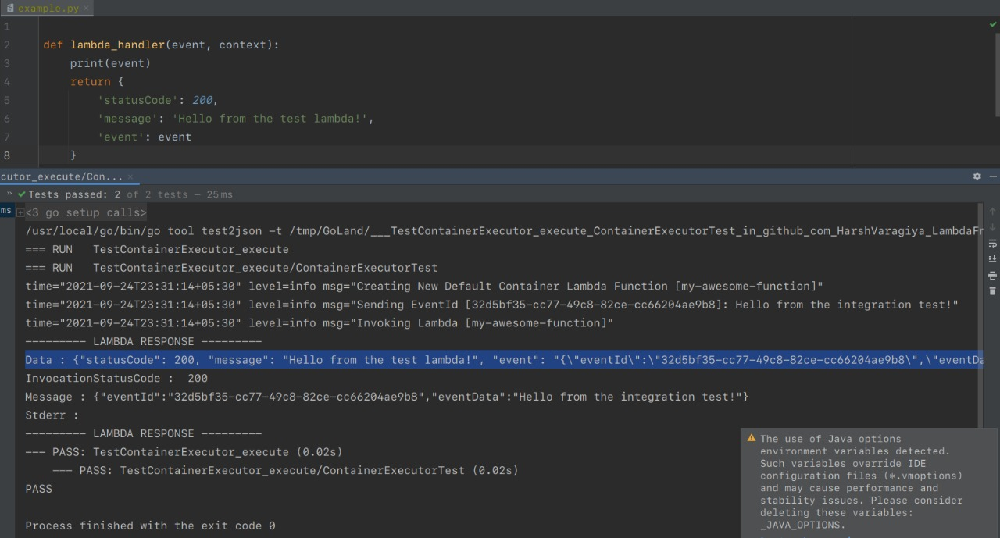
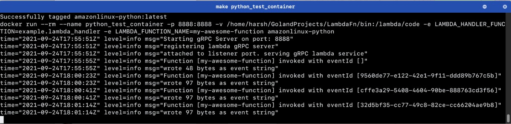

# LambdaFn
An open source, self-hosted service to run AWS Lambda Functions on your own hardware.

## Project
- This project is to try creating a service which can work like AWS Lambda / Google AppEngine
- It would lack the trigger integrations that AWS Provides with its lambda functions
- It would allow user to build a lambda function via AWS Cloudformation templates (drop in replacement)
- It would allow users to execute the lambda and send events via an HTTP REST API 

## Working

## Goals 
The service should allow executing the following:
- Binary on the server running the service
- Code written as Lambda zip running inside container on the server
- Container to be executed on the server (or kubernetes cluster)

## ToDo List
- [x] Implement Code Execution on server as a service (Binary mode)
- [ ] Implement Function as a service inside container (Work in progress)
- [ ] Integrate HTTP REST API to allow creation of lambda functions and executing them
- [ ] Dockerize the whole service
- [ ] Implement Hot & Cold Containers with timeouts
- [ ] Implement Container Running as a service

### Future Goals
- Implement and Integrate an HTTP Proxy (like API Gateway) to allow functions to respond to REST calls
- [ ] Implement methods to monitor resource utilisation by functions
- [ ] Implement Authentication / Authorization on the HTTP REST API 