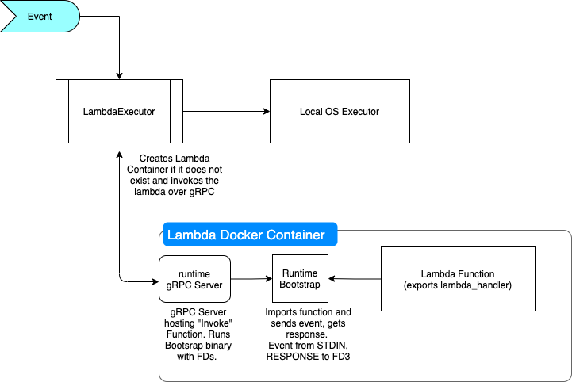

# LambdaFn
An open source, self-hosted service to run AWS Lambda Functions on your own hardware.

**This project is to learn more about Golang, FAAS and cloud computing**

## Project
- This project is to try creating a service which can work like AWS Lambda / Google AppEngine
- All code executions happen on your own hardware. Docker is used to manage containers that run code
- It would lack the trigger integrations that AWS Provides with its lambda functions
- It would allow user to build a lambda function via AWS Cloudformation templates (drop in replacement)
- It would allow users to execute the lambda and send events via an HTTP REST API 

## Working

## Goals 
The service should allow executing the following:
- Binary on the server running the service
- Code written as Lambda zip running inside container on the server
- Container to be executed on the server (or kubernetes cluster)

## ToDo List
- [x] Implement Code Execution on server as a service
- [x] Implement Function as a service inside container
- [x] Integrate HTTP REST API to allow creation of lambda functions and executing them
- [x] Create client binary to allow creating and invoking lambda functions
- [ ] Reformat existing code to use storage package. Create S3 backed local source code cache.
- [ ] Dockerize the whole service (currently looks out of scope due to the nature of storage service)
- [ ] Implement Hot & Cold Containers with timeouts
- [ ] Implement Container Running as a service

### Future Goals
- [ ] Implement and Integrate an HTTP Proxy (like API Gateway) to allow functions to respond to REST calls
- [ ] Implement methods to monitor resource utilisation by functions
- [ ] Implement Authentication / Authorization on the HTTP REST API 